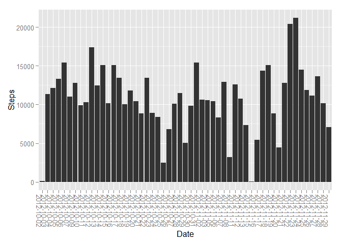
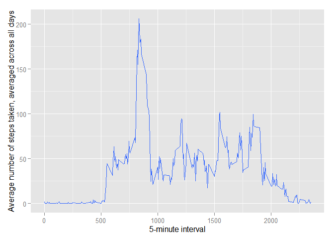
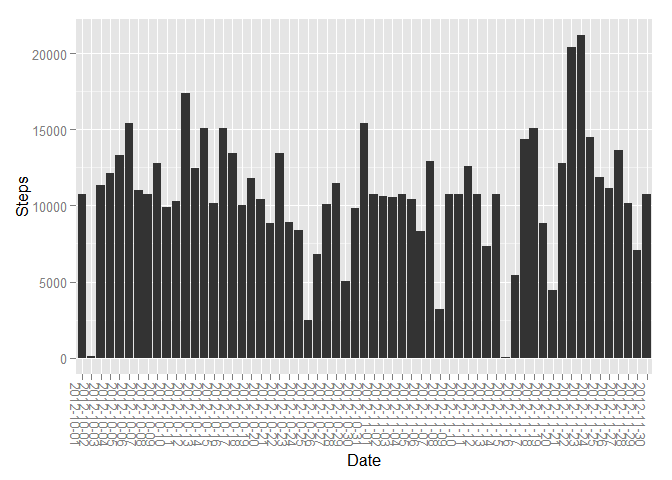
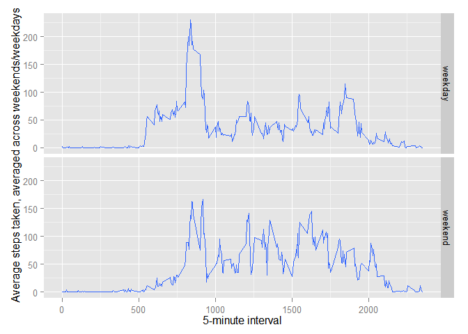

# Reproducible Research: Peer Assessment 1


## Loading and preprocessing the data
Firstly, unzip and read activity.zip into R studio.
A portion of the dataset is as follows.

```r
path <- getwd()
folder<-file.path(path)
filename<-"activity.zip"
f<-file.path(folder,filename)
Data<-read.csv(unzip(f))
head(Data)
```

```
##   steps       date interval
## 1    NA 2012-10-01        0
## 2    NA 2012-10-01        5
## 3    NA 2012-10-01       10
## 4    NA 2012-10-01       15
## 5    NA 2012-10-01       20
## 6    NA 2012-10-01       25
```

## What is mean total number of steps taken per day?
A dataset that contains the sum of steps by each date is created.
The mean and median total number of steps taken per day are calculated and reported.
A portion of the dataset is as follows.

```r
daily_steps<-
    aggregate(formula = steps~date,data = Data,FUN = sum,na.rm=TRUE)
head(daily_steps)
```

```
##         date steps
## 1 2012-10-02   126
## 2 2012-10-03 11352
## 3 2012-10-04 12116
## 4 2012-10-05 13294
## 5 2012-10-06 15420
## 6 2012-10-07 11015
```

The mean and median total number of steps taken per day are calculated and reported.

```r
mean_steps <- round(mean(daily_steps$steps), 2)  # Mean
mean_steps
```

```
## [1] 10766.19
```

```r
median_steps <- quantile(x = daily_steps$steps, probs = 0.5)  # Median
median_steps
```

```
##   50% 
## 10765
```

A histogram of the total number of steps taken each day is made for visual representation.

```r
library(ggplot2)
hist<-qplot(y=steps,
            x=date,
            data=daily_steps,
            geom="bar",
            stat ="identity",
            xlab="Date",
            ylab="Steps")
hist + theme(axis.text.x = element_text(hjust=0, angle=270))
```

 

## What is the average daily activity pattern?
A dataset that contains the interval and average number of steps taken, averaged across all days is created.
A portion of the dataset is as follows.

```r
activity_pattern<-
    aggregate(formula = steps~interval,data = Data,FUN = mean,na.rm=TRUE)
head(activity_pattern)
```

```
##   interval     steps
## 1        0 1.7169811
## 2        5 0.3396226
## 3       10 0.1320755
## 4       15 0.1509434
## 5       20 0.0754717
## 6       25 2.0943396
```

A time series plot is generated where the x-axis is the 5-minute interval and y-axis is the average number of steps taken, averaged across all days.

```r
series_plot<-qplot(y=steps,
            x=interval,
            data=activity_pattern,
            geom="smooth",
            stat ="identity",
            xlab="5-minute interval",
            ylab="Average number of steps taken, averaged across all days")
plot(series_plot)
```

 

The 5-minute interval, on average across all the days in the dataset, containing the maximum number of steps is calculated.

```r
max_steps<-which(activity_pattern$steps == max(activity_pattern$steps))
max_interval<-activity_pattern[max_steps,1]
max_interval
```

```
## [1] 835
```

## Imputing missing values
Calculate and report the total number of missing values in the dataset (i.e. the total number of rows with NAs)

```r
total_NAs <- sum(!complete.cases(Data))
total_NAs
```

```
## [1] 2304
```

Create a new dataset that is equal to the original dataset but with the missing data filled in by using the  mean for that 5-minute interval.

```r
NewData <- Data
ImputedData <- merge(NewData,
                 activity_pattern[,c('interval', 'steps')],
                 by='interval')

ImputedData$steps.x <- ifelse(is.na(ImputedData$steps.x),
                              ImputedData$steps.y,
                              ImputedData$steps.x)
```

Create a new dataset which contains the total number of steps taken each day.
A portion of the dataset is as follows.

```r
New_daily_steps<-
    aggregate(formula = steps.x~date,data = ImputedData,FUN = sum,na.rm=TRUE)
head(New_daily_steps)
```

```
##         date  steps.x
## 1 2012-10-01 10766.19
## 2 2012-10-02   126.00
## 3 2012-10-03 11352.00
## 4 2012-10-04 12116.00
## 5 2012-10-05 13294.00
## 6 2012-10-06 15420.00
```

Calculate and report the mean and median total number of steps taken per day

```r
NewData_mean <- round(mean(New_daily_steps$steps), 2)  # Mean
NewData_mean
```

```
## [1] 10766.19
```

```r
NewData_median <- quantile(x = New_daily_steps$steps, probs = 0.5)  # Median
NewData_median
```

```
##      50% 
## 10766.19
```

A histogram of the total number of steps taken each day is plotted for display.

```r
hist<-qplot(y=steps.x,
            x=date,
            data=New_daily_steps,
            geom="bar",
            stat ="identity",
            xlab="Date",
            ylab="Steps")
hist + theme(axis.text.x = element_text(hjust=0, angle=270))
```

 

## Are there differences in activity patterns between weekdays and weekends?
Create a new factor variable in the dataset with two levels - "weekday" and "weekend" indicating whether a given date is a weekday or weekend day.A portion of the new dataset is as follows.

```r
DayType <- data.frame(sapply(X = ImputedData$date, FUN = function(day) {
    if (weekdays(as.Date(day)) %in% c("Monday", "Tuesday", "Wednesday", "Thursday", 
                                      "Friday")) {
        day <- "weekday"
    } else {
        day <- "weekend"
    }
}))

ImputedData_DayType <- cbind(ImputedData, DayType)
colnames(ImputedData_DayType) <- c("Interval","Steps", "Date", "Mean", "DayType")
head(ImputedData_DayType)
```

```
##   Interval    Steps       Date     Mean DayType
## 1        0 1.716981 2012-10-01 1.716981 weekday
## 2        0 0.000000 2012-11-23 1.716981 weekday
## 3        0 0.000000 2012-10-28 1.716981 weekend
## 4        0 0.000000 2012-11-06 1.716981 weekday
## 5        0 0.000000 2012-11-24 1.716981 weekend
## 6        0 0.000000 2012-11-15 1.716981 weekday
```


A panel plot containing a time series plot of the 5-minute interval (x-axis) and the average number of steps taken, averaged across all weekday days or weekend days (y-axis) is produced for reference.
A new dataset is created containing the mean steps per intveral on weekdays or weekends before the panel plot is created.


```r
DayType_pattern<-aggregate(formula = Steps~Interval+DayType,
                           data = ImputedData_DayType,
                           FUN = mean,
                           na.rm=TRUE)

DayTypeSeries<-qplot(y=Steps,
                   x=Interval,
                   data=DayType_pattern,
                   facets = DayType ~ .,
                   geom="smooth",
                   stat ="identity",
                   xlab="5-minute interval",
                   ylab="Average steps taken, averaged across weekends/weekdays")
plot(DayTypeSeries)
```

 
